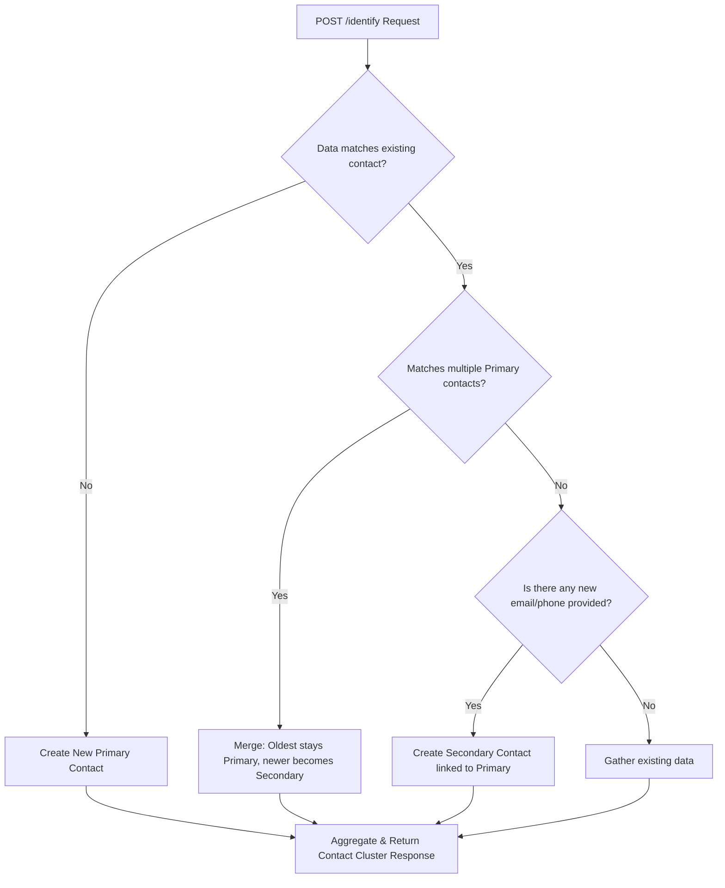

# 🔗 Bitespeed Identity Reconciliation

[](#) *(<- Replace '#' with your actual deployed link)*

## 📖 Overview

An Express/TypeScript service that performs identity reconciliation for customer support tracking. Using a local SQLite database via Prisma, the API accepts an email address and/or phone number and responds with a consolidated contact record, seamlessly merging customer identities across different channels.

## 🧠 Identity Reconciliation Process & Flowchart

The core logic of the `/identify` endpoint ensures that a single user is always tracked under one primary identity, regardless of how many emails or phone numbers they use.

### 🔄 Core Rules
1. **New Customer:** If the provided email and phone number don't match any existing records in our database, a new `primary` contact is created.
2. **Adding New Information:** If the request contains new information (e.g., a new phone number) but matches an existing contact (e.g., by email), a new `secondary` contact is created and linked to the original primary contact.
3. **Merging Identities (The Tricky Part):** If the request contains an email and phone number that currently belong to *separate* primary contacts, the system merges them. The older contact remains `primary`, while the newer contact is updated to `secondary` and linked to the older one.

### 📊 Process Flow Diagram


## 💻 Setup & Run

1. **Clone the repository** or copy the project files to a directory of your choosing.
2. **Install dependencies**:
   ```bash
   npm install
   ```
3. **(Optional) regenerate Prisma client** if you modify `prisma/schema.prisma`:
   ```bash
   npx prisma generate
   ```

### Starting the server

Run:

```bash
npm run dev
```

This starts the app on port `3000` using `ts-node`.  The console will log
"Server is running on port 3000".


## API

### POST /identify

Request body must be JSON and contain _at least one_ of the following fields:

```json
{
  "email": "lorraine@hillvalley.edu",
  "phoneNumber": "123456"
}
```

Response (HTTP 200) returns an object with the contact cluster:

```json
{
  "contact": {
    "primaryContatctId": 1,
    "emails": ["..."],
    "phoneNumbers": ["..."],
    "secondaryContactIds": [2,3]
  }
}
```

Errors are returned with the appropriate status code and JSON description.

> **Note:** a plain GET request to `/identify` will return `Cannot GET /identify`
> because the route only accepts POST.

### Example requests

*Unix / macOS / Linux*
```bash
curl -X POST http://localhost:3000/identify \
  -H "Content-Type: application/json" \
  -d '{"email":"lorraine@hillvalley.edu","phoneNumber":"123456"}'
```

*Windows Command Prompt*
```bat
curl -X POST http://localhost:3000/identify ^
  -H "Content-Type: application/json" ^
  -d "{\"email\":\"lorraine@hillvalley.edu\",\"phoneNumber\":\"123456\"}"
```

*Browser / HTML form*

Open the included `test.html` file in a browser and submit the form – it posts to
`http://localhost:3000/identify` and displays the result.


## Frontend

`test.html` is a simple static page you can open directly in your browser.  It
contains a form for entering email/phone and a script that calls the API and
renders the response.  No additional build step is required.


## Additional notes

* Add a `.gitignore` if you don’t already have one (e.g. ignore `node_modules/`,
  `dev.db`, `dist/`).
* To deploy the frontend, simply host `test.html` on any static‑file server or
  point a GitHub Pages / Netlify site at the repo.
* Update the **Website** field in the repo settings and the section below once
you have a live URL.


---

## 🚀 Deployment Guide (For Live Demo)

To get your live demo working to share with recruiters:
1. **Backend:** Deploy this repository to a free service like [Render](https://render.com/) or [Railway](https://railway.app/). They natively support Node.js and SQLite deployments.
2. **Frontend:** Update the `http://localhost:3000/identify` URL in your `test.html` script to point to your new live backend URL.
3. **Host Frontend:** Upload your `test.html` and index files to [GitHub Pages](https://pages.github.com/) or [Vercel](https://vercel.com/) for a complete live showcase.
